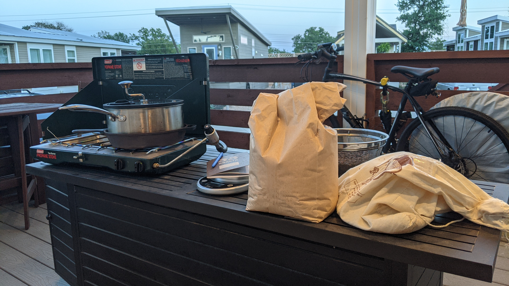
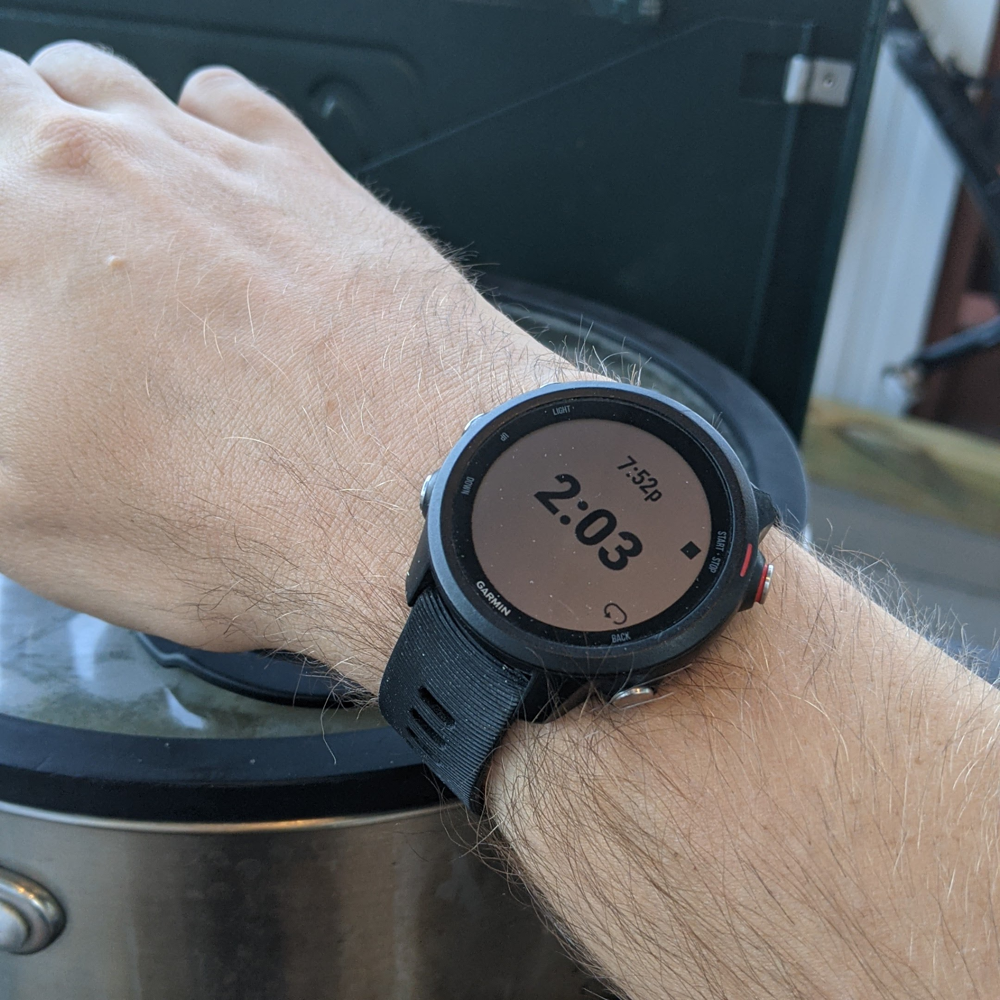
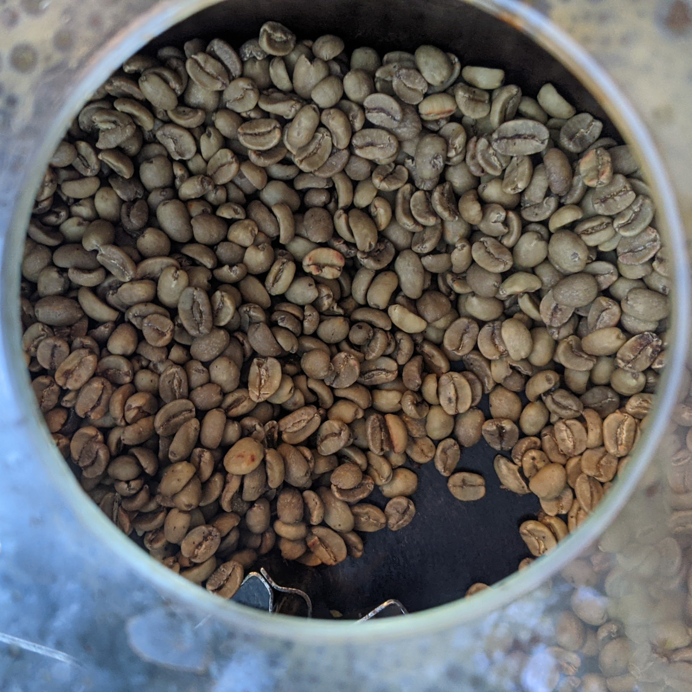
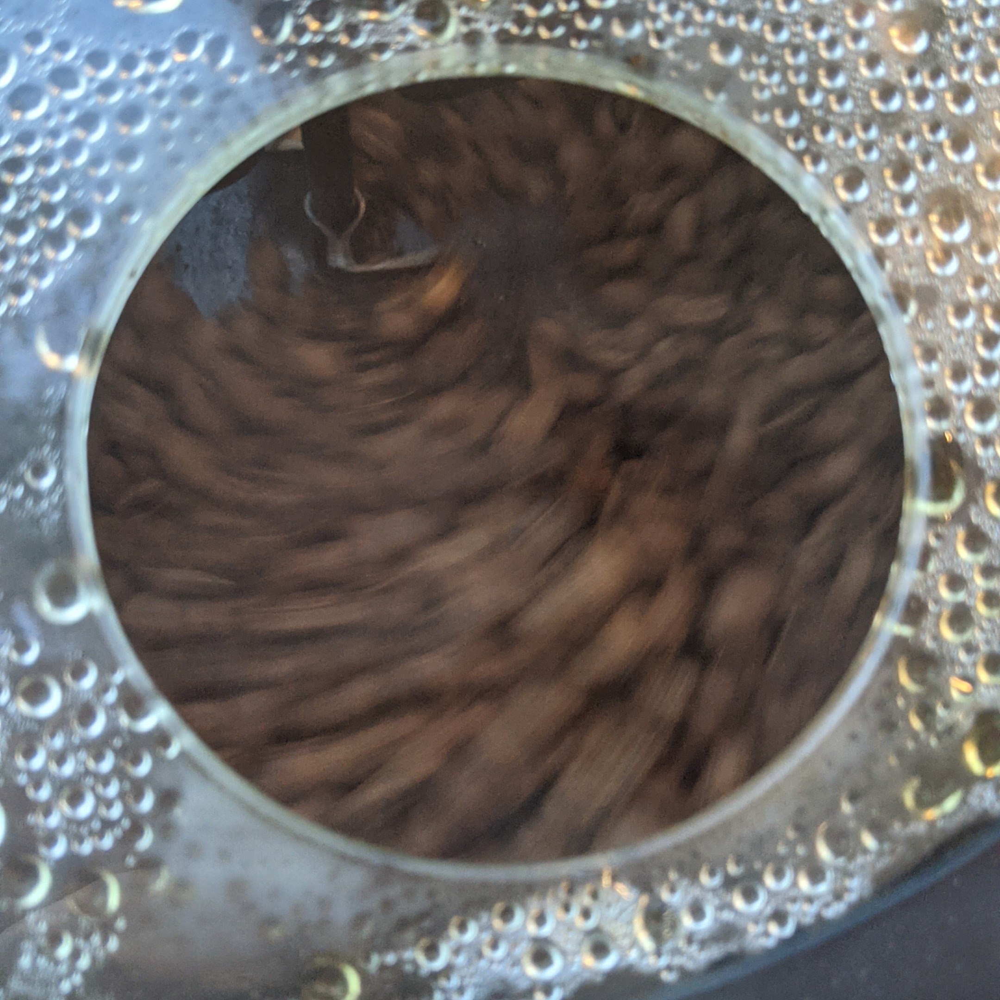

## Intro

I've been casually roasting coffee on and off for several years now. I've been interested in it ever since one of my first summer jobs as a barista at a roastery/coffeeshop. I loved the smell, and being completely addicted to coffee didn't hurt either. I learned it was possible to do it yourself on the cheap with certain types of hot air popcorn poppers. I picked one up at a thrift store and got to it. It was a lot of fun, but it could only handle a few ounces at a time and had some other annoying aspects, like easily scorching the beans if you weren't careful. I eventually got a [Fresh Roast](https://www.sweetmarias.com/roasting/air-roasters/freshroast.html), which aren't all that far removed from the popcorn popper method, and could still only roast a little bit at a time, but was still a modest upgrade Eventually it broke and I faded away from this hobby for awhile.

Some years later I decided to pick this up again after realizing I could easily roast a pound at time with a stovetop popcorn popper. I used a [Victorio StovePop](https://vkpbrands.com/store/stovepop-stainless-steel-popper.html) for a good while until I broke it, and replaced it with my current roaster, which I hope will last me a very long time. I now use a [Zippy Pop](https://zippypop.com/) which is particularly great. It has a heavy-duty steel frame, a glass top. Most importantly, the crank looks like it'll never break, which is the fate that took the StovePop.

I simply put the popper on a cast iron skillet, which helps with heat distribution, and preheat a basic 2-burner camping stove for about five minutes. Then I pour in the beans and I'm off to roasting. I roasted a couple batches this weekend, here's how it went.

## First batch

Jackie likes keeping her caffeine levels in check so I often brew us a pot of half-caf in the morning. Roasting our own let's me make sure we still have good coffee as let's face it, most decaf coffee leaves a lot to be desired. This is a nice chocolatey coffee that roasts evenly, which is often trickier with decafs. Decafs in general are harder to roast. When roasting coffee, you listen for two cracks that help guide you and let you know how far into the process you are. With decafs though, these cracks are much more subtle, and the coffee usually roasts a lot quicker. This is why I generally roast the decaf first, as the roaster still hasn't warmed up fully after just five minutes, but I'm an impatient guy. Below is the roast log.

- **Coffee**: Burundi Collines Decaf
- **Purchased from**: [Sweet Maria's](https://www.sweetmarias.com/)
- **Date**: 5/16/21
- **Preheat time**: 5 mins
- **Temp**: 76°
- **Humidity**: 71%
- **Green weight**: 16oz
- **Roast weight**: 13.37oz
- ** Weight loss**: 16%
- ** First crack**: 9:45
- ** Second crack**: 13:30
- ** Finish**: 14:30
- ** Roast level**: Full city

As with a lot of decafs, I barely heard the first crack, and it was a bit late. It made we worried about the second crack being too late as well, but it was right on time. 

## Second batch

The second batch is some Ethiopian Yirgacheffe. It's many people's favorite and is known for being bright, sweet, and complex. I actually know very little about the particular batch I have, I bought as much as I could from a coworker who used to run a roastery. I've been rather pleased with it.

- **Coffee**: Ethiopian Yirgacheffe
- **Purchased from**: Coworker
- **Date**: 5/16/21
- **Preheat time**: 0 mins, immediately after first batch
- **Temp**: 71°
- **Humidity**: 72%
- **Green weight**: 16oz
- **Roast weight**: 14.14oz
- ** Weight loss**: 12%
- ** First crack**: 7:35
- ** Second crack**: 8:55
- ** Finish**: 9:10
- ** Roast level**: Full city+

I was actually going for a lighter roast here, this one caught be off guard a little bit. I should have adjusted the temperature a bit. I used to have a good thermometer but I haven't taken the time to install a good one on my current setup. You need a special candy thermometer as a regular oven one will melt, given the high temperatures requires. I'll get around to it soon I'm sure. Anyway that's all to say I have been doing this all by sight and sound.  It came out quicker than expected but still roasted evenly.

I'm not sure why I like roasting coffee so much. In a strange way, I find it sort of meditative. If you have any interest, I encourage you to give it a try. It's actually quite easy, and there's no need to take precise exacting measurements. You get a feel for it over time.