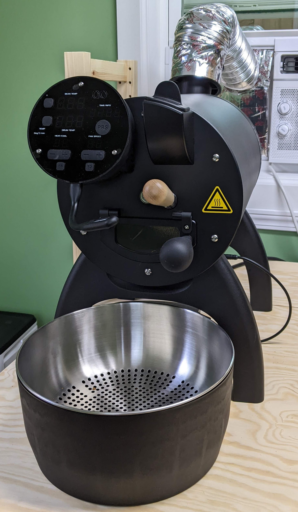

import RoastLog from 'components/RoastLog';

I've been thinking about upgrading my coffee roaster from my [charming yet old primitive setup](/an-introduction-to-roasting-coffee). I hesitated for so long because an upgrade was very expensive, and any modest upgrade had drawbacks that made it not worth it. I simply don't have the time I used to have before becoming a dad, so "upgrading" to a machine that could roast less than what I could make on the stovetop was simply a non-starter. After much research, I splurged on an Aillio Bullet R1 V2. Thankfully it is a joy to use. _(It better be given the price)_

One of the neater features it has is the ability to log stats about your roast in realtime. You can then export that data into a CSV. Of course, it reminded me of this neglected blog and I wanted to try to render out one of these "roast profiles" in React. I was also looking for an excuse to try out the aptly named [React Charts](https://react-charts.tanstack.com/), as I wanted to see if I liked it better than [Recharts](https://recharts.org/).

It is tough to find the time to update this blog, even this simple post was in draft status for several days as I put off finding time to export the CSV data as it wasn't as straightforward as I assumed. First I reached for [papaparse](https://www.papaparse.com/) to generate the chart data. However it didn't work by itself and I ended up using `gatsby-transformer-csv` instead. Also long story short, I lost my patience with `react-charts` and stuck with `recharts`. It just works. I'll be updating as I go with more datapoints, formatting the data better, and more. I would also like to do a deeper dive explaining what these numbers mean as a follow-up.

For now, the minimum-viable-product was to simply render a super basic line chart that has been parsed from a CSV. Anyway, voila:

<RoastLog />
